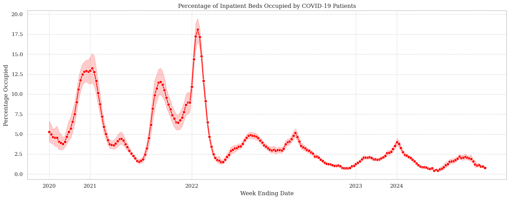
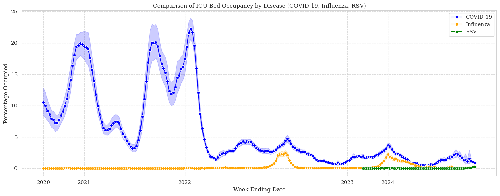

# Hospital Respiratory Forensics

> Class: **🟪 Visualization**  
> Dataset used: **[Weekly Hospital Respiratory Data and Metrics (Kaggle)](https://www.kaggle.com/datasets/noeyislearning/weekly-hospital-respiratory-data-and-metrics)**  
> Notebooks: **[Deepnote](https://deepnote.com/app/noeyislearning/Hospital-Respiratory-Forensics-7ca65703-6319-4f50-9991-e093cfafe43c)**

A comprehensive analysis of hospital respiratory data, spanning from August 2020 through October 2024. This dataset, meticulously aggregated to national and state/territory levels, is reported to the Centers for Disease Control and Prevention’s (CDC) National Health Safety Network (NHSN). It offers a detailed view of metrics related to hospital capacity, occupancy, hospitalizations, and new admissions for COVID-19, Influenza, and Respiratory Syncytial Virus (RSV). The data reflects both mandated and voluntary reporting periods, capturing the dynamic changes in reporting requirements by the Centers for Medicare and Medicaid Services (CMS).

## Visualizations

### [Percentage of Inpatient Beds Occupied by COVID-19 Patients](https://www.kaggle.com/code/noeyislearning/hospital-respiratory-forensics/notebook#Percentage-of-Inpatient-Beds-Occupied-by-COVID-19-Patients)

**Key Observations**

- **Initial Spike in 2020**: The graph shows a significant initial spike in the percentage of inpatient beds occupied by COVID-19 patients in 2020. This is consistent with the early stages of the COVID-19 pandemic when the virus first emerged and healthcare systems were overwhelmed.
- **Fluctuations Over Time**: The percentage of inpatient beds occupied by COVID-19 patients fluctuates over the years, indicating varying levels of COVID-19 activity. There are periods of higher occupancy, followed by periods of lower occupancy, suggesting that the pandemic was not consistent in its impact on hospital resources.
- **Peak in 2021**: There appears to be a peak in 2021, where the percentage of inpatient beds occupied by COVID-19 patients reaches its highest point. This could be attributed to various factors such as the spread of new variants, changes in public health measures, and the general progression of the pandemic.
- **Decline in 2022 and 2023**: The percentage of inpatient beds occupied by COVID-19 patients shows a decline in 2022 and 2023. This could be due to increased vaccination rates, better treatment options, and more effective public health strategies.
- **Moderate Levels in 2024**: By 2024, the percentage of inpatient beds occupied by COVID-19 patients remains relatively moderate, suggesting that the pandemic has become more manageable, although not completely eradicated.

**Conclusion**

The graph illustrates the dynamic nature of the COVID-19 pandemic's impact on hospital inpatient bed occupancy. It highlights the initial surge in 2020, the peak in 2021, and the subsequent decline and stabilization in the following years. This visualization is crucial for understanding the burden of COVID-19 on healthcare systems and the effectiveness of public health interventions over time.

### [Comparison of ICU Bed Occupancy by Disease (COVID-19, Influenza, RSV)](https://www.kaggle.com/code/noeyislearning/hospital-respiratory-forensics/notebook#Comparison-of-ICU-Bed-Occupancy-by-Disease-(COVID-19,-Influenza,-RSV))

**Key Observations**

- **COVID-19 Dominance in 2020 and 2021**: The graph shows that COVID-19 occupied a significant percentage of ICU beds in 2020 and 2021, reaching its peak during these years. This is consistent with the global impact of the COVID-19 pandemic during its initial and peak phases.
- **Influenza and RSV Occupancy**: Influenza and RSV show lower occupancy rates compared to COVID-19 throughout the observed period. However, there are noticeable spikes in ICU bed occupancy for both Influenza and RSV, particularly in 2021 and 2022. These spikes could be attributed to seasonal outbreaks of these respiratory diseases.
- **Decline in COVID-19 Occupancy in 2022 and 2023**: The percentage of ICU beds occupied by COVID-19 patients shows a decline in 2022 and 2023. This could be due to increased vaccination rates, better treatment options, and more effective public health strategies.
- **Fluctuations in Influenza and RSV**: The occupancy rates for Influenza and RSV fluctuate over the years, indicating seasonal variations and periodic outbreaks. The peaks in these diseases' occupancy rates suggest that they continue to pose a significant burden on ICU resources, especially during their respective seasons.
- **Moderate Levels in 2024**: By 2024, the percentage of ICU beds occupied by COVID-19, Influenza, and RSV remains relatively moderate, suggesting that the healthcare system has adapted to managing these diseases more effectively.

**Conclusion**

The graph illustrates the dynamic nature of ICU bed occupancy by COVID-19, Influenza, and RSV over the years. It highlights the dominance of COVID-19 in 2020 and 2021, the subsequent decline in its occupancy rates, and the fluctuating but significant impact of Influenza and RSV. This visualization is crucial for understanding the burden of these diseases on ICU resources and the effectiveness of public health interventions over time. The data suggests that while COVID-19 initially overwhelmed ICU capacities, the healthcare system has adapted to manage all three diseases more effectively by 2024.

###### More visualizations [here](https://www.kaggle.com/code/noeyislearning/hospital-respiratory-forensics/notebook).
